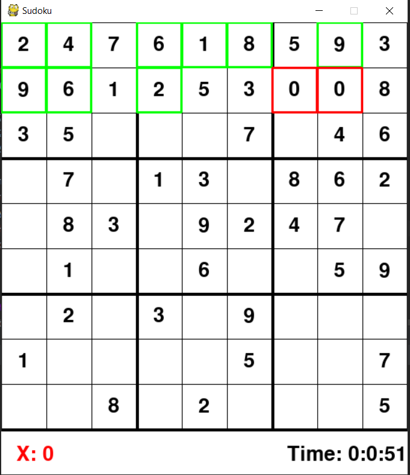

# Sudoku #
Playable Sudoku puzzle game with board generator and auto solver function

## To play: ##
  Run the StartMenuDesign.py file
  
  
  
## About the game: ##
  - Difficulty selector based on number of attempts to remove squares, which can be changed in the code in the StartMenuDesign.py file
  - Double tap space to auto-solve Sudoku board (May take a while depending on level of difficulty selected - sometimes up to 10 minutes or more)
  - Loading the game can take some time, depending on the difficulty selected due to the algorithm (up to 1 minute)

     